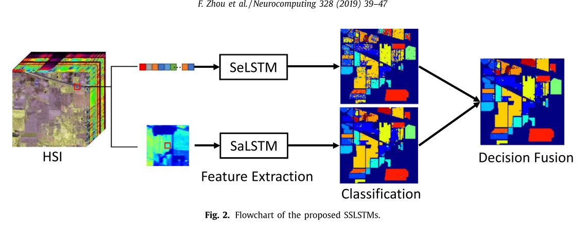

# SSLstm
## Introduction
This is a reproduction of *Hyperspectral image classification using spectral-spatial LSTMs*.

## Requirements
* pytorch 1.3
* scikit-learn
* scipy
* visdom
## Experiment
模型分别在PaviaU，Salinas和KSC这三个基准数据集上进行测试。实验总共分为三组，分别为每类样本量为10，每类样本量为50和每类样本量为100。为了减少误差，每组实验分别进行10次，最终的准确率取10次实验的均值。

在PaviaU数据集上的准确率（%）如下表所示：

<table>
<tr align="center">
<td colspan="6">PaviaU</td>
</tr>
<tr align="center">
<td colspan="2">10</td>
<td colspan="2">50</td>
<td colspan="2">100</td>
</tr>
<tr align="center">
<td>mean</td>
<td>std</td>
<td>mean</td>
<td>std</td>
<td>mean</td>
<td>std</td>
</tr>
<tr align="center">
<td>69.59</td>
<td>5.84</td>
<td>84.50</td>
<td>1.82</td>
<td>87.19</td>
<td>6.10</td>
</tr>
</table>

在Salinas数据集上的准确率（%）如下表所示：

<table>
<tr align="center">
<td colspan="6">Salinas</td>
</tr>
<tr align="center">
<td colspan="2">10</td>
<td colspan="2">50</td>
<td colspan="2">100</td>
</tr>
<tr align="center">
<td>mean</td>
<td>std</td>
<td>mean</td>
<td>std</td>
<td>mean</td>
<td>std</td>
</tr>
<tr align="center">
<td>81.20</td>
<td>3.30</td>
<td>91.37</td>
<td>1.50</td>
<td>94.41</td>
<td>0.36</td>
</tr>
</table>

在KSC数据集上的准确率（%）如下表所示：

<table>
<tr align="center">
<td colspan="6">KSC</td>
</tr>
<tr align="center">
<td colspan="2">10</td>
<td colspan="2">50</td>
<td colspan="2">100</td>
</tr>
<tr align="center">
<td>mean</td>
<td>std</td>
<td>mean</td>
<td>std</td>
<td>mean</td>
<td>std</td>
</tr>
<tr align="center">
<td>83.07</td>
<td>1.59</td>
<td>98.72</td>
<td>0.90</td>
<td>99.68</td>
<td>0.36</td>
</tr>
</table>
# Runing the code
训练光谱分支 `python TrainBySpectral.py --name xx --epoch xx --lr xx`
训练空间分支 `python TrainBySpatial.py --name xx --epoch xx --lr xx`
联合预测 `python JointPredict.py`
